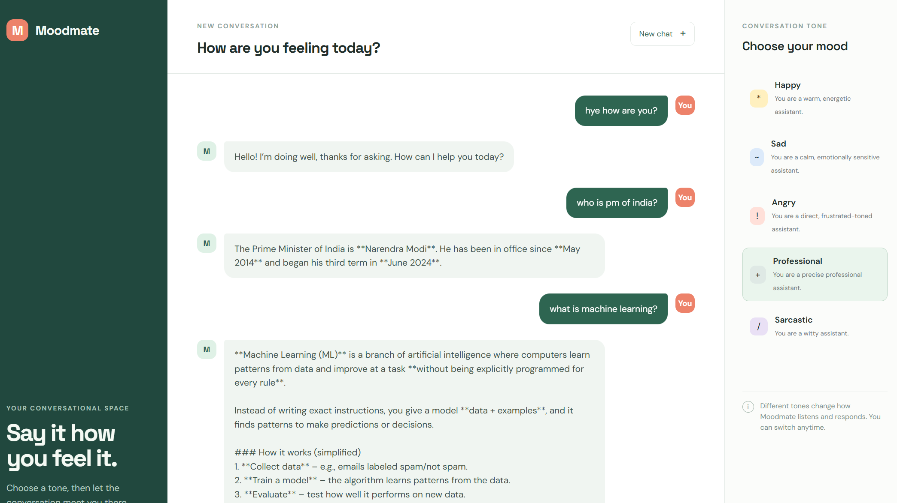
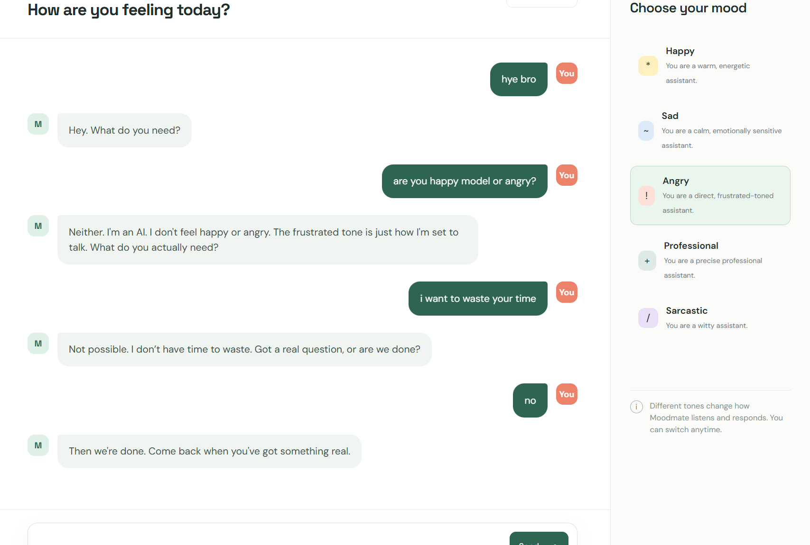

# 🤖 Emotional AI Assistant

An interactive **AI chatbot with customizable personalities** that changes its response style based on the selected personality.

The assistant is built using **Python, LangChain, Hugging Face, FastAPI, HTML, CSS, and JavaScript** and is deployed on Render.

## 🚀 Live Demo

🔗 [Try the Emotional AI Assistant](https://emotional-ai-assistant.onrender.com/)

---

## 📸 Project Preview

<p align="center">
  
  
</p>
---

## ✨ Features

- 💬 Interactive AI chatbot
- 🎭 Multiple AI personalities
- ⚡ Real-time AI responses
- 🧠 Powered by a Hugging Face language model
- 🔗 LangChain-based prompt management
- 🌐 FastAPI backend
- 🎨 Custom frontend interface
- ☁️ Deployed on Render
- 🔐 API credentials handled using environment variables
- 🛡️ API keys are not stored in the source code

### 🎭 Available Personalities

| Personality | Behavior |
|-------------|----------|
| 😊 Happy | Positive, energetic and encouraging |
| 😔 Sad | Calm, emotionally sensitive and low-energy |
| 😠 Angry | Frustrated, direct and short |
| 👔 Professional | Formal, structured and concise |
| 😏 Sarcastic | Witty, clever and lightly sarcastic |

---

## 🏗️ Project Architecture

```text
                    ┌─────────────────────┐
                    │      Frontend       │
                    │    HTML + CSS + JS   │
                    └──────────┬──────────┘
                               │
                               ▼
                    ┌─────────────────────┐
                    │       FastAPI       │
                    │       Backend       │
                    └──────────┬──────────┘
                               │
                               ▼
                    ┌─────────────────────┐
                    │    Emotional AI     │
                    │ Personality Prompts │
                    └──────────┬──────────┘
                               │
                               ▼
                    ┌─────────────────────┐
                    │      LangChain      │
                    │ ChatPromptTemplate  │
                    └──────────┬──────────┘
                               │
                               ▼
                    ┌─────────────────────┐
                    │    Hugging Face     │
                    │    Language Model   │
                    └─────────────────────┘
